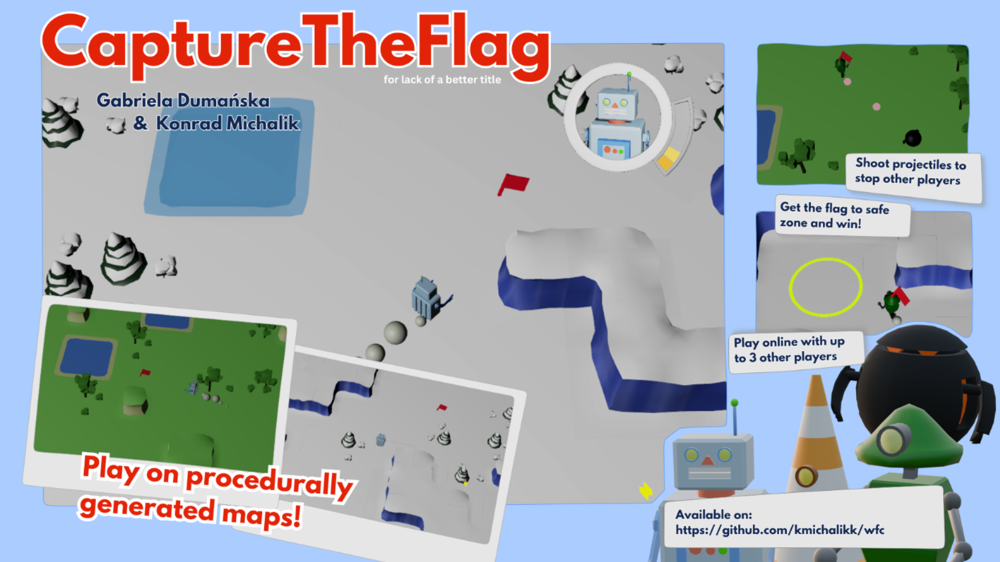

# CaptureTheFlag: A Wave Function Collapse Minigame

This project was developed for the **Programming in Python** course as part of the **Computer Science** program at AGH University. It received a **5.0 grade**. The game combines elements of a **shooter** and a **capture the flag** mode, allowing players to test their reflexes and agility on a 3D map generated using the **Wave Function Collapse (WFC)** algorithm.

## Key Features ##
- **Multiplayer Support** – Allows players to connect and play across multiple computers over a network.
- **Client-Server Architecture** – Features a robust client-server mechanism for multiplayer interaction.
- **WFC Algorithm** – Utilizes the Wave Function Collapse algorithm for procedural 3D map generation.
- **Panda3D Engine** – Built using the powerful Panda3D library for 3D rendering and game development.
- **Database Integration** – Uses databases to store and track player performance and game results.
- **Semester-long Development** – The project was developed over the course of the entire semester, with bi-weekly progress reviews and adherence to an initial project plan.



## Setup Instructions ##

To run the game, follow these steps:

1. Create the `common/config.py` file from the example provided in `common/config.py.sample`.
2. Create an SQLite3 database file:
   - **On Linux**:
     ```bash
     sqlite3 server/accounts/accounts.db < server/accounts/accounts.sql
     ```
   - **On Windows**:
     ```bash
     sqlite3 server/accounts/accounts.db ".read server/accounts/accounts.sql"
     ```
